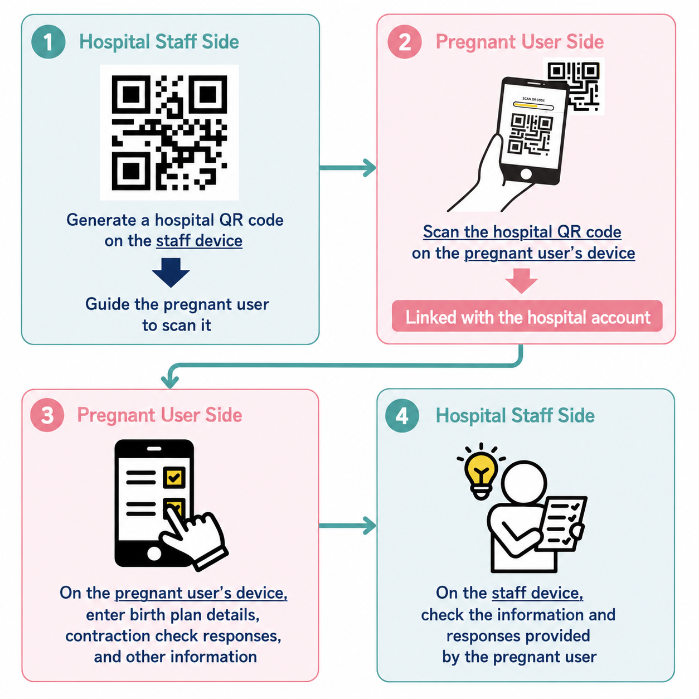

# How to Use This App

## Introduction

### What You Can Do With This App

This service is a LINE official account made up of a LINE chat bot and web apps. It supports communication with hospital staff from pregnancy through childbirth.
It supports multilingual display in 20 languages other than Japanese, so foreign pregnant women can use it in their native language or in a language they understand easily.

#### Point 1

The main features include conversation phrase tools for pointing to phrases when communicating with hospital staff, vaccination record management, Birth Plan support, records for Weight, Blood Pressure, and Blood Sugar measurements, Contraction Timer, Kick Counter, and a labor check tool.
It also includes information about pregnancy and childbirth customs and systems in Japan, plus tools that support translation.

#### Point 2

This service can be linked with a hospital.
If your hospital uses this service, you can scan the hospital QR code in advance. Then data you enter in this service can be shared with the hospital.

## Preparation

### Open Profile Registration

Tap `A-4 My Data` in the LINE chat menu.
The `Profile Registration` button will appear in the chat. Tap it to open the screen.

### 1. Register Your Information

In `Your Information`, enter your name, age, nationality, native language, due date, and other details.
Entering your Japanese level is optional, but we recommend doing so to make communication during prenatal checkups smoother.
After entering your information, tap `Save`.

### 2. Link With Your Hospital

If this service is used by the hospital you visit or plan to deliver at, scan the hospital QR code shown by the hospital and complete hospital registration.
This lets hospital staff view the data you enter through this service.

From `Registered Hospitals`, tap `Scan Hospital QR Code` and scan the hospital QR code with your camera.
After scanning, enter your `Patient ID Card No.`, `Travel Time to Hospital (minutes)`, and whether you plan to deliver at this hospital, then tap `Register`.

> The following data is shared with the hospital. Please be careful if it contains information you do not want to share.
>
> Profile Registration (`Your Information`, patient ID card number for that hospital, travel time, and whether you plan to deliver there), Vaccination, Birth Plan, Weight, Blood Pressure, Blood Sugar, Contraction Timer, Kick Counter, Edinburgh Postnatal Depression Scale (EPDS), and labor check results

#### Change Hospital Information

To change your patient ID card number, travel time to the hospital, or whether you plan to deliver there, edit the information inside the registered hospital card and tap `Save`.

#### Delete a Hospital Registration

If you change hospitals or no longer want to share data with a hospital, you can unlink it from `Delete Registration`.
After deletion, that hospital's staff devices will no longer be able to view your shared data.

### 3. Register Contacts

In `Contact Information`, register important contacts such as family members or labor taxi services.
Tap `Add Contact`, enter the contact name and phone number, then tap `Save`.
Registered contacts can be accessed quickly from `C-2 Contacts` in the LINE chat menu.

> It is useful to register people or services you may need to call quickly in an emergency.

## Basic Features

### Conversation Phrases

The conversation phrase tools, also called the Communication Board, include phrases often used at Reception, Examination, and Midwife Consultation during prenatal checkups.
Use them by selecting what you want to say to support communication with hospital staff.

#### Reception

This page contains conversation phrases often used at reception.

#### Examination

This page contains conversation phrases often used during examinations.
When you select what you want to say, audio is played in both the selected language and Japanese.

#### Midwife Consultation

This page contains conversation phrases often used during midwife consultations.
When you select what you want to say, audio is played in both the selected language and Japanese.
You can also use the EPDS, a mental health check sheet for pregnant and postpartum women, from this page. Please use the EPDS when hospital staff ask you to do so.

### Vaccination

Tap `A-4 My Data` in the LINE chat menu, then select the `Vaccination` button shown in the chat.
Record your vaccination status so you can tell the hospital.
If you have already received a vaccine, enter the vaccination date as far as you know.

### Birth Plan

Tap `A-4 My Data` in the LINE chat menu, then select the `Birth Plan` button shown in the chat.
You can organize and record your preferences for childbirth and things you want to tell hospital staff.
If you have registered your planned delivery hospital in Profile Registration, items that the hospital cannot support are grayed out and cannot be selected or entered. Use this as a reference when thinking about your Birth Plan.

Use what you enter here as a reference when you create your actual Birth Plan at a midwife outpatient visit or similar appointment.

### Weight

Tap `A-4 My Data` in the LINE chat menu, then select the `Weight` button shown in the chat.
You can record your weight and measurement date and time.
If you set the start of pregnancy, pre-pregnancy weight, due date, and target weight at delivery, you can check how your weight is changing compared with the target.

### Blood Pressure

Tap `A-4 My Data` in the LINE chat menu, then select the `Blood Pressure` button shown in the chat.
You can record systolic blood pressure, diastolic blood pressure, and measurement date.
Saving results measured at checkups or at home makes it easier to review changes.

### Blood Sugar

Tap `A-4 My Data` in the LINE chat menu, then select the `Blood Sugar` button shown in the chat.
You can record your blood sugar level and measurement date.
Use this when hospital staff ask you to keep blood sugar records.

### Memo

You can freely record concerns, questions you want to ask at an examination, daily symptoms, and other notes.
Memos are saved as your own private records and are not shared with the hospital.

### Contacts

This shows the contacts registered in `Contact Information` on the `Profile Registration` screen.

### Contraction Timer

When contractions start, you can record how long pain or abdominal tightening continues.
Tap `Start measurement`, tap `Contraction` when pain starts, and tap `Settled` when it stops.
Finally, tap `End measurement` to save one record.

### Kick Counter

Use this to count your baby's movements.
When you feel a kick, tap the button and check the number of movements and the time.

### Labor Check

During labor, you can check whether you should contact the hospital immediately.
Your answers are shared with the hospital, so they can help explain your situation.
If the result is `Please contact the hospital.`, call the hospital immediately and **tell them your patient ID card number and that you answered the labor check.**

<mark>Even if the result is `Let's wait and see for a while.`, contact the hospital immediately if the situation feels urgent.</mark>

## Useful Information

### Today's Baby

Based on the due date entered in `Your Information` on the `Profile Registration` screen, this page shows the progress of pregnancy and how your baby is growing now.

### Guidebook

You can view the "Mama and Baby Support Series", a multilingual information booklet created by the Research Association for Multicultural Society (RASC) for foreign women, their families, and people who support childbirth and childcare.
If your language is not available, the English version is shown.

### FAQ

You can check information about systems and procedures related to childbirth and childcare, customs related to pregnancy and childbirth in Japan, and common questions and answers during pregnancy.

## Translation Features

### Translation Apps

This page lists recommended apps for translation.
Use them as needed when you have trouble communicating at an examination or reception.

### Translation Camera

When you tap the `Translation Camera` button, the LINE camera opens.
The LINE camera has a standard feature that automatically recognizes and translates text shown in an image.
After the LINE camera opens, select `Text recognition` from the bottom menu on the shooting screen, then take a photo of the text you want to translate or select an image.

## Other

### Language Switching

The language used in this service is switched automatically based on the language setting in the LINE app.
On web screens, you can also temporarily switch to another language from the language switch button in the top-right corner.
This service supports the following languages.

Chinese, Korean, Vietnamese, Tagalog, Portuguese, Nepali, Indonesian, English, Thai, Russian, French, German, Lao, Ukrainian, Dari, Sinhala, Malay, Burmese, Bengali, Urdu

### Transferring Data

The data you use in this service is linked to your LINE account.
Therefore, if your LINE account data is transferred to a new device, you can continue using your data as before.

### Handling of Data

This service is intended to support communication from pregnancy through childbirth.
Saved records are not electronic medical records for diagnosis or treatment.
If you are worried about your physical condition, always consult a doctor, midwife, nurse, or other hospital staff.

## Notes

- Do not decide what to do based only on app results when you have symptoms
- Contact the hospital early if you are worried about your physical condition
- If you lose your smartphone, check LINE account management and stop use of the device
