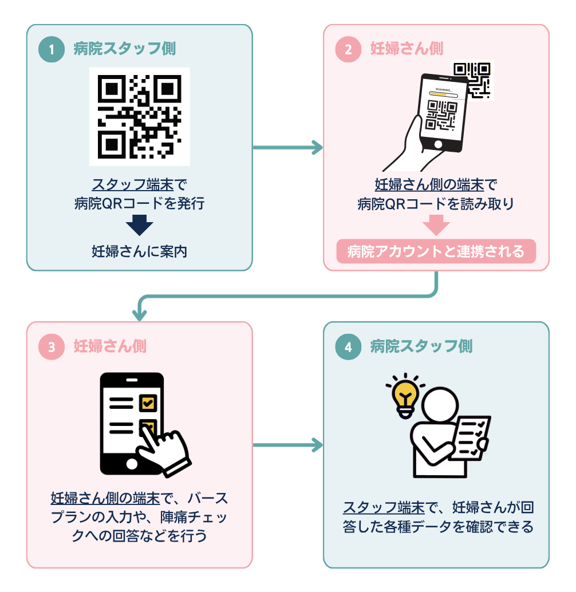

# このアプリの使い方

## はじめに

### このアプリケーションでできること

本サービスはLINEのチャットbotとWebアプリで構成されたLINE公式アカウントで、妊娠中から出産までの病院スタッフとのコミュニケーションをサポートします。
多言語表示（日本語以外に20言語）に対応しているため、外国人妊婦さんは母語や自分の理解しやすい言語でご利用可能です。

#### Point-1

主な機能に、病院スタッフとの会話を指差しで可能にする会話フレーズ機能、ワクチン接種記録の管理機能、バースプランの作成支援機能、体重・血圧・血糖値の測定結果の記録機能、陣痛・胎動カウンター機能、陣痛チェック機能があります。
その他にも、日本での妊娠出産に関する慣習や制度などの情報や、翻訳をサポートするツールをまとめています。

#### Point-2

本サービスには病院との連携機能があります。
病院側が本サービスを導入している場合、妊婦さん側は病院QRコードの読み取りによって予め連携しておくことで、本サービスで入力した各種データを病院側に共有することができます。

## 事前準備

### プロフィール登録画面を開く

LINEチャット画面メニューの`A-4 マイデータ`を押します。
チャット画面に`プロフィール登録`ボタンが表示されるので選択してください。

### 1. あなたの情報を登録する

`あなたの情報`に名前、年齢、国籍、母語、出産予定日などを入力しておきましょう。
日本語レベルの入力は任意ですが、妊婦健診時のコミュニケーションを円滑にするために登録しておくことをおすすめします。
入力したら`保存`を押してください。

### 2. 病院と連携する

通院中または分娩予定の病院で本サービスが導入されている場合は、病院から提示された病院QRコードを読み取り、病院登録を行っておきましょう。
本サービスを通じてユーザが入力した各種データを、病院スタッフが確認できるようになります。

`登録済みの病院`から、`病院QRコードを読み取る`を押し、カメラで病院QRコードを読み取ってください。
読み取り後、診察券番号、病院までの所要時間、この病院で分娩予定かどうかを入力して`登録`を押します。

> 病院共有対象のデータは以下のとおりです。病院と共有したくない内容を含む場合は注意してください。
>
> プロフィール登録（あなたの情報、当該院の診察券番号・所要時間・分娩予定有無）、ワクチン接種、バースプラン、体重、血圧、血糖値、陣痛カウンター、胎動カウンター、妊産婦のメンタルチェックシート（EPDS・エジンバラ質問票）、陣痛チェック

#### 病院情報を変更する

診察券番号、病院までの所要時間、分娩予定の有無を変更したい場合は、登録済みの病院カード内で内容を修正し、`保存`を押してください。

#### 病院の登録を解除する

通院先を変更した場合など、連携をやめたい病院は`登録を削除`から解除できます。
削除すると、その病院のスタッフ端末からあなたの共有データを確認できなくなります。

### 3. 連絡先を登録する

`連絡先情報`では、家族や陣痛タクシーなど、必要な連絡先を登録しておきましょう。
`連絡先を追加`を押し、連絡先名と電話番号を入力して`保存`してください。
登録した連絡先は、LINEチャット画面の`C-2 連絡先`からすぐにアクセスすることができます。

> 緊急時にすぐ電話できるように、連絡する可能性がある相手を登録しておくと便利です。

## 基本機能

### 会話フレーズ

会話フレーズ（コミュニケーションボード）機能では、妊婦健診時の受付・診察・保健指導の場面でよく使うフレーズを収録しています。
伝えたい内容を互いに選択しながら利用し、コミュニケーションの支援にお役立てください。

#### 受付

受付でよく使う会話フレーズが掲載されています。

#### 診察

診察でよく使う会話フレーズが掲載されています。
伝えたい内容を選択すると翻訳言語と日本語で音声が再生されます。

#### 保健指導

保健指導でよく使う会話フレーズが掲載されています。
伝えたい内容を選択すると翻訳言語と日本語で音声が再生されます。
妊産婦のメンタルチェックシートであるEPDSもこのページから行えます。EPDSは、病院スタッフから指示があった場合にご利用ください。

### ワクチン接種

LINEチャット画面メニューの`A-4 マイデータ`を押して、チャット画面に表示される`ワクチン接種`ボタンを選択して開くことができます。
自身のワクチン接種の状況を病院に伝えるため、記録しておきましょう。
接種済みの場合は、分かる範囲で接種日も入力しておきましょう。

### バースプラン

LINEチャット画面メニューの`A-4 マイデータ`を押して、チャット画面に表示される`バースプラン`ボタンを選択して開くことができます。
出産時の希望や、病院スタッフへ伝えたいことを整理して記録しておくことができます。
プロフィール登録で、分娩予定の病院を病院登録している場合、その病院が対応できない項目はグレーアウトされ、選択や入力ができません。自身のバースプランを考える参考にしてください。

ここで入力した内容は、助産師外来などで実際にバースプランを作成する際の参考に利用してください。

### 体重

LINEチャット画面メニューの`A-4 マイデータ`を押して、チャット画面に表示される`体重`ボタンを選択して開くことができます。
体重と測定日時を記録できます。
妊娠開始時期と妊娠前の体重、出産予定日と出産時の目安体重を設定しておくと、目安に対する体重の増減具合を確認できます。

### 血圧

LINEチャット画面メニューの`A-4 マイデータ`を押して、チャット画面に表示される`血圧`ボタンを選択して開くことができます。
最高血圧、最低血圧、測定日を記録できます。
健診時やご自宅で測定した結果を保存しておくと、変化を確認しやすくなります。

### 血糖値

LINEチャット画面メニューの`A-4 マイデータ`を押して、チャット画面に表示される`血糖値`ボタンを選択して開くことができます。
血糖値と測定日を記録できます。
病院スタッフから血糖値の記録の指示がある場合に利用してください。

### メモ

気になること、診察で聞きたいこと、日々の体調などを自由に記録できます。
メモは自分用の記録として保存され、病院には共有されません。

### 連絡先

`プロフィール登録`画面の`連絡先情報`で登録した連絡先の一覧が表示されます。

### 陣痛カウンター

陣痛が始まった時に、痛みやお腹の張りの継続時間を記録できます。
`測定開始`を押してから、痛みが始まったら`陣痛`、おさまったら`おさまった`を押してください。
最後に`測定終了`を押すと、1回分の記録として保存されます。

### 胎動カウンター

赤ちゃんの動きを数えるために使います。
胎動を感じたらボタンを押し、回数と時間を確認してください。

### 陣痛チェック

陣痛時に、病院にすぐに連絡したほうが良いかどうかをチェックすることができます。
回答した内容は病院に共有されるので、状況を伝える手助けになります。
結果が`病院へ連絡しましょう`となった場合は、すぐに病院に電話し、 **診察券番号と、陣痛チェックに回答したことを伝えましょう。**

<mark>結果が`もう少し様子をみましょう`となった場合でも、緊急を要する状況の場合は、すぐに病院に連絡しましょう。</mark>

## お役立ち情報

### 今日のベビー

`プロフィール登録`画面の`あなたの情報`で入力した出産予定日に基づいて、妊娠の経過と今のお腹の赤ちゃんの成長の様子が表示されます。

### ガイドブック

多文化医療サービス研究会（RASC：ラスク）が作成する、外国人女性やその家族、出産・育児を支える人のための多言語情報冊子である「ママとあかちゃんのサポートシリーズ」を閲覧できます。
対応言語がない場合は、英語版が表示されます。

### Q&A

出産や育児に関係する制度や手続きの情報や、日本での妊娠出産に関する慣習などをまとめた情報、妊娠中によくある質問と回答を確認できます。

## 翻訳機能

### 翻訳アプリ

おすすめの翻訳に使えるアプリをリストアップしています。
診察や受付で言葉に困ったときに、必要に応じて利用してください。

### 翻訳カメラ

`翻訳カメラ`のボタンを押すと、LINEカメラが起動します。
LINEカメラには標準機能として、画像に写った文字を自動で認識し翻訳してくれる機能があります。
LINEカメラが開いたら、撮影画面の下部メニューから`文字認識`を選び、翻訳したい文章を写して撮影、もしくは画像選択をしてください。

## その他

### 言語切替について

本サービスで使用する言語は、LINEアプリで設定している言語によって自動的に切り替わります。
Web画面では、右上の言語切り替えボタンから、一時的に別言語に切り替えることも可能です。
本サービスが対応している言語は以下のとおりです。

中国語、韓国語、ベトナム語、タガログ語、ポルトガル語、ネパール語、インドネシア語、英語、タイ語、ロシア語、フランス語、ドイツ語、ラオス語、ウクライナ語、ダリ語、シンハラ語、マレー語、ミャンマー語、ベンガル語、ウルドゥー語

### データ引き継ぎについて

本サービスでご利用中のデータはLINEアカウントに紐づいています。
そのため、移行先の端末でLINEアカウントのデータ引き継ぎが行われれば、引き続きこれまで通りご利用になれます。

### データの取り扱いについて

本サービスは、妊娠中から出産までのコミュニケーションをサポートするためのものです。
保存した記録は、診断や治療を行うための電子カルテではありません。
体調に不安がある場合は、必ず医師、助産師、看護師などの病院スタッフに相談してください。

## 注意事項

- 症状があるときは、アプリの結果だけで判断しない
- 体調に不安があるときは、早めに病院へ連絡する
- スマートフォンを紛失した場合は、LINEアカウントの管理や端末の利用停止を確認する
